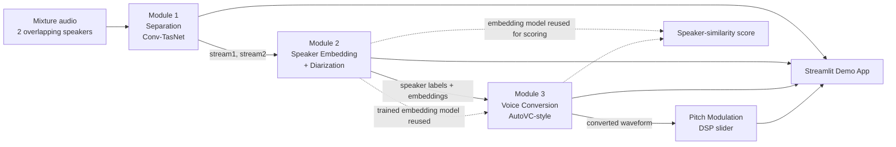

# Cocktail Party Problem — Phase 1 Build Spec

An integrated deep learning pipeline: **speech separation → speaker diarization → voice conversion**, combined into a locally-hosted Streamlit demo. This document is the implementation spec — build the project by working through it top to bottom.

Team: Prakhar Sahu (Separation) · Sanmay Anand (Diarization) · Hriday Jadhav (Voice Conversion) · Ankush Pratham (Integration). One agent building this solo should still implement it in that module order, since Module 3 depends on Module 2's trained embedding network and the demo app depends on all three.

---

## 0. Build Order (do not parallelize out of order)

1. **Scaffold** the repo structure and environment (Section 3–4).
2. **Module 1 — Separation** end-to-end: data → train → eval → `separation.py`. This has no dependency on the other modules — build it first and get it fully working before touching anything else.
3. **Module 2 — Diarization** end-to-end: data → train → eval → `diarization.py`. Also independent of Module 1/3, but Module 3 needs its output, so it must finish before Module 3 starts.
4. **Module 3 — Voice Conversion**: this *imports and calls* Module 2's trained embedding model (frozen, not retrained) as its speaker-identity encoder. Do not stub this with a fake embedding — the report specifies this as the real cross-module integration point, and skipping it defeats the point of the project.
5. **Integration**: Streamlit app wiring all three together.
6. **Verification pass**: run the full checklist in Section 10 before calling anything "done."

Do not build the Streamlit app before at least one module has a working, tested inference function — you'll end up mocking interfaces you then have to rewrite.

---

## 1. Non-Goals (explicitly out of scope — do not build these)

| Deferred to Phase 2 | Reason |
|---|---|
| Live microphone streaming inference | Pre-recorded clips only for Phase 1 |
| Full-scale training / SepFormer at scale | Compute budget is free-tier Colab |
| End-to-end neural diarization (EEND), overlap-aware diarization | Clustering fixed-window embeddings is the Phase 1 approach |
| Zero-shot / any-to-any voice conversion | Train on 2–4 fixed VCTK speakers only |
| Fully learned pitch/formant modulation in the vocoder | DSP pitch-shift slider is the guaranteed-to-work baseline |
| Minutes-of-Meeting (Whisper ASR + LLM summarization) | Not built this phase — only add if all three modules finish early |
| Cloud/hosted deployment | Local Streamlit (`localhost:8501`) only |

If you find yourself implementing anything in the left column, stop — it's scope creep against the spec.

---

## 2. System Architecture



Everything shares one representation: waveform → mel-spectrogram/latent, and one embedding network (Module 2's) is reused wherever speaker identity matters. That reuse is what makes this one integrated system rather than three disconnected scripts — don't build three separate embedding implementations.

---

## 3. Repository Structure

```
cpp_project/
├── README.md
├── requirements.txt
├── .gitignore
├── configs/
│   ├── separation.yaml
│   ├── diarization.yaml
│   └── voice_conversion.yaml
├── data/                          # gitignored — raw + processed datasets
│   ├── librimix/
│   ├── voxceleb/
│   └── vctk/
├── scripts/
│   ├── download_librimix.sh
│   ├── download_voxceleb.md       # manual registration steps, not automatable
│   ├── download_vctk.sh
│   └── download_hifigan_checkpoint.sh
├── models/
│   ├── separation.py              # exposes separate()
│   ├── diarization.py             # exposes get_embedding(), diarize()
│   └── voice_conversion.py        # exposes convert(), modulate()
├── training/
│   ├── train_separation.py
│   ├── train_diarization.py
│   └── train_voice_conversion.py
├── evaluation/
│   ├── eval_separation.py         # SI-SDRi, optional PESQ/STOI
│   ├── eval_diarization.py        # accuracy, t-SNE, DER
│   └── eval_voice_conversion.py   # speaker-similarity, MOS survey template
├── checkpoints/                   # gitignored — .pt files
├── samples/                       # small, committed — known-good demo clips
├── notebooks/
│   ├── 01_separation_training.ipynb
│   ├── 02_diarization_training.ipynb
│   └── 03_voice_conversion_training.ipynb
├── results/
│   ├── loss_curves/
│   ├── metrics/                   # CSV/JSON tables per module
│   └── audio_examples/            # before/after clips for the report
├── tests/
│   ├── test_separation.py
│   ├── test_diarization.py
│   └── test_voice_conversion.py
└── app.py                         # Streamlit UI, orchestrates the pipeline
```

`checkpoints/` and `data/` are large and environment-specific — gitignore them. `samples/` stays small and committed so the repo is demo-ready out of the box.

---

## 4. Environment Setup

`requirements.txt`:
```
torch
torchaudio
asteroid
speechbrain
librosa
pyrubberband
streamlit
scikit-learn
matplotlib
numpy
soundfile
pandas
pyyaml
tqdm
```

Pin exact versions once the training environment (Colab T4 vs local GPU vs CPU) is confirmed working — unpinned installs on a fresh Colab runtime are the single most common source of "worked yesterday, broken today."

Set a global random seed (e.g. `42`) in every training script (`torch`, `numpy`, and `random` modules) — the deliverables require loss curves and metrics that should be reproducible run to run.

**Colab-specific:** save checkpoints to Google Drive every N epochs, not just at the end — free-tier runtimes disconnect without warning. Keep dataset subsets in the hundreds of files, not thousands, so a full training run fits inside one session.

---

## 5. Cross-Module Interface Contract

This is the part most likely to break silently if skipped — implement these signatures exactly, since `app.py` and Module 3 both depend on them:

```python
# models/separation.py
def separate(mixture_path: str) -> tuple[np.ndarray, np.ndarray]:
    """Loads a mixture audio file, returns (stream1, stream2) waveforms
    at the model's native sample rate."""

# models/diarization.py
def get_embedding(audio: np.ndarray, sr: int) -> np.ndarray:
    """Returns a fixed-length speaker embedding vector (192 or 256-dim)."""

def diarize(audio: np.ndarray, sr: int) -> list[tuple[str, float, float]]:
    """Returns [(speaker_id, start_sec, end_sec), ...]."""

# models/voice_conversion.py
def convert(source_audio: np.ndarray, target_speaker_ref: np.ndarray, sr: int) -> np.ndarray:
    """Converts source_audio into the voice of the speaker in target_speaker_ref.
    Internally calls diarization.get_embedding() on target_speaker_ref — do not
    reimplement a second embedding model here."""

def modulate(audio: np.ndarray, sr: int, pitch_factor: float) -> np.ndarray:
    """DSP pitch-shift (librosa/pyrubberband), independent of the trained models."""
```

### Critical integration risks — resolve these explicitly, don't let them surface as silent bugs

1. **Sample rate mismatch.** Libri2Mix "min" is 8kHz; VoxCeleb and VCTK are typically distributed at 16kHz. If Module 1 is trained at 8kHz and Modules 2/3 at 16kHz, the pipeline will resample somewhere whether you intend it or not. Decide on **one canonical sample rate for the whole pipeline** (16kHz is the safer default — resample Libri2Mix mixtures up rather than degrading the speaker datasets down) and enforce it in every module's I/O boundary, not just internally.
2. **Mel-spectrogram parameters must match the pretrained HiFi-GAN checkpoint exactly** — `n_fft`, `hop_length`, `win_length`, `n_mels`, `fmin`/`fmax`. If Module 3's autoencoder produces mels with different parameters than what HiFi-GAN was trained on, the vocoder output will be audible noise, not degraded speech — this is a common AutoVC+HiFi-GAN integration failure and worth a dedicated sanity check (feed a *ground-truth* mel through the vocoder alone first, before ever routing your model's output through it).
3. **Embedding dimensionality** must match between what `get_embedding()` returns and what Module 3's speaker-conditioning input expects. Assert this at import time, not at runtime failure.
4. **VoxCeleb requires manual registration** on the Oxford VGG page before download — this cannot be automated in a script. Flag this as a human action item in `scripts/download_voxceleb.md` rather than attempting to script around it.
5. **Diarization cluster count.** For the 2-speaker demo case you can hardcode k=2 for agglomerative clustering; document this assumption clearly, since a general diarizer wouldn't know the speaker count in advance and that's explicitly deferred to Phase 2 (EEND).

---

## 6. Module 1 — Speech Separation

**Objective:** neural net takes a single-channel 2-speaker mixture, outputs two per-speaker waveforms, with no fixed correspondence between output channel and speaker identity.

**Dataset:** Libri2Mix ("min" version, 8kHz), ~300–500 training mixture pairs, ~50 test pairs.
- Generation scripts: `github.com/JorisCos/LibriMix`
- Underlying corpus: `openslr.org/12` (LibriSpeech, public domain)
- Optional noisy-condition backup/stretch dataset: WHAM! (`wham.whisper.ai`)

**Architecture:** Conv-TasNet (primary) — encoder (1D conv, replaces STFT) → separator (stack of dilated TCN blocks estimating a per-speaker mask) → decoder (1D transposed conv reconstructing each waveform). Use Asteroid's Conv-TasNet as a reference implementation, then retrain the weights on your own split — this is legitimate since you're training the weights yourself, not running inference on someone else's checkpoint. DPRNN is an optional stretch upgrade for a small ablation if time allows.
- Reference: `github.com/asteroid-team/asteroid`
- Paper: Luo & Mesgarani, "Conv-TasNet," `arxiv.org/abs/1809.07454`

**Loss:** Utterance-level Permutation Invariant Training (uPIT) — compute loss for both output-to-target assignments, backprop through whichever is lower — using Scale-Invariant SDR:

```
SI-SDR = 10 · log10( ||s_target||² / ||e_noise||² )
```

where `s_target` is the projection of the estimate onto the true reference and `e_noise` is the residual. Train to maximize SI-SDR (minimize negative SI-SDR).

**Implementation steps:**
1. Download/preprocess Libri2Mix (min, subset of 300–500 train / 50 test mixtures).
2. Build a `torch.utils.data.Dataset`/`DataLoader` yielding `(mixture_waveform, [speaker1_waveform, speaker2_waveform])`.
3. Implement or adapt Conv-TasNet (encoder, TCN separator, decoder).
4. Implement uPIT + SI-SDR loss.
5. Train 15–30 epochs, logging train/val loss per epoch — **save a loss-vs-epoch plot to `results/loss_curves/`, this is required evidence of real training.**
6. Run inference on held-out test set, compute SI-SDRi (improvement over unprocessed mixture).
7. Save 3–5 example separated clips + before/after spectrograms to `results/audio_examples/`.

**Evaluation:** SI-SDRi (dB) on held-out test split (primary). PESQ/STOI optional secondary metrics. Qualitative spectrogram before/after.

**Definition of done:**
- [ ] `checkpoints/separation.pt` exists and loads
- [ ] `results/loss_curves/separation_loss.png` shows a decreasing loss curve over ≥15 epochs
- [ ] `results/metrics/separation_sisdri.csv` has per-test-file SI-SDRi and a mean
- [ ] `models/separation.py::separate(mixture_path)` returns two waveforms and runs standalone (no dependency on Module 2/3)
- [ ] `tests/test_separation.py` passes on a sample mixture from `samples/`

---

## 7. Module 2 — Speaker Embedding & Diarization

**Objective:** map a short audio clip to a fixed-length embedding such that same-speaker clips cluster together in embedding space; use this for diarization ("who spoke when").

**Dataset:** VoxCeleb1 subset (~20–30 speakers, a few hundred utterances). VoxCeleb2 optional/larger. **Requires registration on the Oxford VGG page before download — plan for this in the timeline, it is not scriptable.**
- `robots.ox.ac.uk/~vgg/data/voxceleb/vox1.html`

**Architecture:** compact ECAPA-TDNN-style network (fall back to a simplified x-vector TDNN if ECAPA is too heavy to train from scratch in the available time):
- Frame-level TDNN/1D-conv layers over MFCCs or mel-spectrograms
- Statistics pooling (mean + std) to an utterance-level vector
- Fully-connected embedding layer (192 or 256-dim output)
- SpeechBrain has reference ECAPA-TDNN recipes to adapt: `speechbrain.github.io`
- Paper: Desplanques et al., "ECAPA-TDNN," `arxiv.org/abs/2005.07143`

**Loss:** AAM-Softmax (ArcFace-style) — trains as a closed-set speaker classifier over your subset, maximizing angular separation between speaker classes. After training, discard the final classification layer; use the penultimate layer's output as the embedding for new (even unseen) speakers.

**Implementation steps:**
1. Download VoxCeleb subset; extract log-mel or MFCC features per utterance.
2. Build the TDNN/ECAPA network with statistics pooling + embedding layer.
3. Implement AAM-Softmax; train as closed-set classifier (15–25 epochs).
4. Save loss/accuracy curves.
5. Extract held-out embeddings; visualize with t-SNE colored by speaker identity — this is the required evidence the embeddings are discriminative.
6. Build the diarization function: sliding window → per-window embedding → agglomerative clustering → speaker labels + timestamps.
7. Evaluate diarization on a small self-constructed test set (concatenated known-speaker clips with known ground-truth boundaries).

**Evaluation:** classification accuracy on held-out utterances; t-SNE plot (qualitative); Diarization Error Rate (DER) on the self-built test set.

**Definition of done:**
- [ ] `checkpoints/diarization.pt` exists and loads
- [ ] `results/loss_curves/diarization_loss_acc.png` shows training curves
- [ ] `results/metrics/tsne_embeddings.png` shows visibly separated speaker clusters
- [ ] `results/metrics/diarization_der.csv` reports DER on the self-built test set
- [ ] `models/diarization.py::get_embedding()` and `::diarize()` both work standalone on a sample clip
- [ ] `tests/test_diarization.py` passes

---

## 8. Module 3 — Voice Conversion & Modulation

**Objective:** convert speech from a source speaker into a target speaker's voice while preserving linguistic content; apply controllable pitch modulation on top.

**Dataset:** VCTK Corpus, use only 2–4 speakers (e.g. one male, one female pair).
- `datashare.ed.ac.uk/handle/10283/3443`

**Architecture:** scaled-down AutoVC-style autoencoder:
- Content encoder: narrow information bottleneck over the input mel-spectrogram, deliberately capacity-limited so speaker identity can't leak through
- Speaker encoder: **reuses Module 2's trained, frozen embedding network** — this is the concrete cross-module integration point, do not implement a separate encoder here
- Decoder: reconstructs a mel-spectrogram conditioned on the content bottleneck + target speaker embedding
- Vocoder: pretrained HiFi-GAN converts the output mel back to waveform (using a pretrained vocoder here is standard practice, including in the original AutoVC paper — the novel/trainable part is the disentanglement autoencoder, not the vocoder)
- Paper: Qian et al., "AutoVC," `arxiv.org/abs/1905.05879`
- Reference: `github.com/auspicious3000/autovc`
- Vocoder: `github.com/jik876/hifi-gan`

**Loss:** (1) self-reconstruction — when target speaker = source speaker, output should reconstruct the input mel; (2) content-code consistency — the content bottleneck output should be identical regardless of target speaker, enforcing that speaker identity is fully removed from the content path.

**Modulation:** baseline is DSP pitch-shift (librosa `pitch_shift` or `pyrubberband`) exposed as a UI slider — this is the guaranteed-to-work path, build it first. A learned F0-conditioning module is a stretch goal only.

**Implementation steps:**
1. Select 2–4 VCTK speakers; extract mel-spectrograms.
2. Build content encoder + decoder; wire in Module 2's trained embedding network (frozen) as the speaker-identity input.
3. Implement self-reconstruction + content-consistency training objective.
4. Train (start with a narrow bottleneck dimension and small speaker subset to keep it tractable).
5. Route the trained model's mel output through pretrained HiFi-GAN → converted waveform. **Sanity-check the vocoder alone first with a ground-truth mel before trusting end-to-end output** (see Section 5, risk #2).
6. Implement the pitch-shift slider (librosa/pyrubberband).
7. Collect before/after/after-pitch-shifted samples for the demo and report.

**Evaluation:** speaker-similarity (cosine similarity between Module 2's embedding of the converted output and the true target embedding — reuses Module 2's trained model directly); content preservation (informal transcription check); MOS naturalness (informal 1–5 listening survey among the group/classmates).

**Definition of done:**
- [ ] `checkpoints/voice_conversion.pt` exists and loads
- [ ] `results/metrics/speaker_similarity.csv` compares converted-vs-target vs converted-vs-source cosine similarity
- [ ] `results/audio_examples/` has original / converted / converted+pitch-shifted triples
- [ ] `models/voice_conversion.py::convert()` correctly calls `diarization.get_embedding()` internally (not a duplicate encoder)
- [ ] `models/voice_conversion.py::modulate()` works independently of the trained model
- [ ] `tests/test_voice_conversion.py` passes

---

## 9. Integration: Streamlit Demo App

**Why Streamlit:** pure Python, no frontend/backend split, built-in widgets cover every UI need here (upload, record, sliders, tables, plots), runs at `localhost:8501` with one command — satisfies "locally hosted" with zero deployment work.

**Demo flow (`app.py`):**
1. Upload or select a sample mixture file (default to `samples/` for reliability).
2. "Separate" button → Module 1 runs → two playable waveforms + before/after spectrogram.
3. "Diarize" button → Module 2 labels each stream with a speaker ID → timeline table.
4. Select a stream + a reference target-voice clip → "Convert Voice" button → Module 3 output + speaker-similarity score (via Module 2's embedding model).
5. Pitch slider → modulates any output stream, replays instantly.

**Reliability tip:** bundle 2–3 pre-tested clips in `samples/` as guaranteed-to-work fallbacks. Live mic recording in a classroom setting is fragile (background noise, hardware) — demo on known-good files first, live recording as a bonus only.

**Run command:**
```bash
streamlit run app.py
```

---

## 10. Full Verification Checklist (run before calling Phase 1 complete)

- [ ] Each module's standalone function works in isolation on a sample clip (no Streamlit needed to test)
- [ ] Sample rate is consistent end-to-end — trace one clip through all three modules and confirm no unintended resampling
- [ ] Module 3's speaker encoder is provably the same weights as Module 2's trained model (not reinitialized)
- [ ] All three loss/metric curves exist under `results/loss_curves/`
- [ ] All three metrics tables exist under `results/metrics/` (SI-SDRi, accuracy+DER, speaker-similarity)
- [ ] `streamlit run app.py` completes the full demo flow (Section 9) end-to-end on a `samples/` clip without errors
- [ ] `requirements.txt` installs clean in a fresh environment
- [ ] Checkpoints are gitignored; `samples/` is small enough to commit
- [ ] README's Definition of Done for each module (Sections 6–8) is fully checked off

---

## 11. Evaluation Summary

| Module | Metric | How computed |
|---|---|---|
| Separation | SI-SDRi (dB) | SI-SDR of separated output vs. raw mixture, vs. ground-truth references, held-out test split |
| Diarization | Classification accuracy; DER | Held-out utterance accuracy for the embedding classifier; DER on self-built diarization test set |
| Voice Conversion | Speaker-similarity (cosine sim.) | Embedding distance between converted output and true target speaker, using Module 2's trained network |
| Voice Conversion | MOS (naturalness, 1–5) | Informal listening survey among group/classmates |

---

## 12. Stretch Goals (only if core modules finish with time to spare)

These are optional, in priority order — do not start these before every Definition of Done checklist above is fully checked:

1. **DPRNN ablation for Module 1** — train DPRNN alongside Conv-TasNet, compare SI-SDRi/params/inference time. Turns the module into an architecture comparison, not just a single trained model.
2. **WHAM! noisy-condition run** — same Conv-TasNet architecture, retrained on WHAM!'s noisy mixtures, clean-vs-noisy SI-SDRi comparison.
3. **PESQ/STOI** as secondary separation metrics — cheap once separated audio exists.
4. **Minutes-of-Meeting pipeline** — diarized transcript via Whisper ASR, summarized by an LLM. Good demo flourish since it chains onto existing diarization output, but genuinely optional.

---

## 13. References

- D. Wang & J. Chen, "Supervised speech separation based on deep learning," IEEE/ACM TASLP, 2020.
- Y. Luo & N. Mesgarani, "Conv-TasNet," IEEE/ACM TASLP, 2019. `arxiv.org/abs/1809.07454`
- Y. Luo, Z. Chen, T. Yoshioka, "Dual-path RNN," ICASSP, 2020.
- C. Subakan et al., "Attention is all you need in speech separation," ICASSP, 2021.
- B. Desplanques, J. Thienpondt, K. Demuynck, "ECAPA-TDNN," Interspeech, 2020. `arxiv.org/abs/2005.07143`
- D. Snyder et al., "X-vectors," ICASSP, 2018.
- K. Qian et al., "AutoVC," ICML, 2019. `arxiv.org/abs/1905.05879`
- J. Kong, J. Kim, J. Bae, "HiFi-GAN," NeurIPS, 2020.
- A. Nagrani, J. S. Chung, A. Zisserman, "VoxCeleb," Interspeech, 2017.
- C. Veaux, J. Yamagishi, K. MacDonald, "CSTR VCTK Corpus," University of Edinburgh, 2019.

---

## 14. Dataset Sources (quick reference)

| Dataset | Used for | Source | Notes |
|---|---|---|---|
| Libri2Mix | Separation training | `github.com/JorisCos/LibriMix` | Free, derived from LibriSpeech; use 'min' subset |
| LibriSpeech | Underlying corpus | `openslr.org/12` | Public domain |
| WHAM!/WHAMR! | Noisy separation (optional) | `wham.whisper.ai` | Adds real background noise |
| VoxCeleb1/2 | Speaker embedding training | `robots.ox.ac.uk/~vgg/data/voxceleb` | Requires registration before download |
| VCTK | Voice conversion training | `datashare.ed.ac.uk/handle/10283/3443` | 110 speakers; use only 2–4 |
