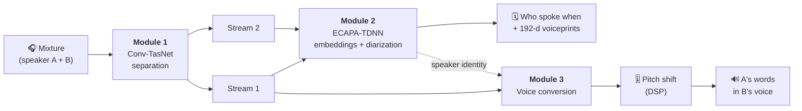

# 🎤 CocktailFlow: Solving the Cocktail Party Problem

**Separate overlapping voices, work out who spoke when, and convert one voice into another, all in one pipeline that trains on a CPU.**


At a crowded party, people can focus on one voice and tune out the rest. This is known as the *cocktail party problem*. CocktailFlow rebuilds a version of it as a three-stage deep-learning pipeline with an interactive web demo:

1. **Separate:** split a recording of two people talking at once into one clean track per speaker.
2. **Diarize:** fingerprint each voice and work out *who spoke when*.
3. **Convert:** re-voice one speaker's words in another speaker's voice, then shift the pitch if you like.

> 📘 **Want the full explanation?** [`PROJECT_GUIDE.md`](PROJECT_GUIDE.md) covers every architecture, the maths behind it, training and evaluation in detail.

---

## ✨ Features

- **Single-microphone speech separation** with Conv-TasNet, which works directly on the waveform.
- **Speaker embeddings** with ECAPA-TDNN: a 192-dim voiceprint that works on speakers it has never heard.
- **Speaker diarization:** voice activity detection, sliding-window embeddings and clustering produce a speaker timeline.
- **Zero-shot voice conversion** from a few seconds of reference audio. It uses OpenVoice v2, or the project's own AutoVC + HiFi-GAN.
- **Pitch modulation** of ±12 semitones.
- **Two backends per module:** pretrained models for quality, or models implemented and trained from scratch here. Switch with one line of config.
- **Streamlit app** to try it all in the browser.
- **Reproducible:** one seeded speaker split shared by every module, so no test speaker ever leaks into training.

---

## 🧭 How it works



| Module | Task | Architecture | Key idea |
|---|---|---|---|
| **1. Separation** | mixture → 2 voices | **Conv-TasNet**: learned conv encoder → dilated TCN mask estimator → transposed-conv decoder | Trained with an **SI-SDR** loss and **permutation-invariant training**, so it doesn't matter which output gets which speaker |
| **2. Diarization** | voice → 192-d embedding; audio → speaker timeline | **ECAPA-TDNN**: SE-Res2Net blocks, multi-layer aggregation, attentive statistics pooling | Trained with **AAM-Softmax (ArcFace)** so voices separate by angle; segments are then grouped by agglomerative clustering |
| **3. Voice conversion** | source speech + target reference → converted speech | **OpenVoice v2** (VITS-style normalising flow) *or* **AutoVC + HiFi-GAN** | AutoVC squeezes content through a narrow **information bottleneck** so the voice is supplied separately; OpenVoice swaps the voice inside an **invertible flow** |
| **Pitch** | shift by *n* semitones | phase vocoder + resampling | frequency ratio $r = 2^{n/12}$ |

The modules talk to each other only through a small API: `separate()`, `get_embedding()`, `diarize()`, `convert()` and `modulate()`. With the custom backend, the voice-conversion model uses **Module 2's speaker embedding as its speaker encoder**. That embedding is the integration point between the two modules.

---

## 🧠 Models

Each module has two interchangeable backends, selected by `backend:` in `configs/*.yaml`. **All three default to `pretrained`.**

| Module | `pretrained` (default) | `custom` (implemented & trained in this repo) |
|---|---|---|
| Separation | [Asteroid Conv-TasNet](https://huggingface.co/JorisCos/ConvTasNet_Libri2Mix_sepclean_16k), Libri2Mix 16 kHz, 5.1 M params | Conv-TasNet, 2.5 M params (N=256, L=32, B=128, H=256, X=8, R=3) |
| Speaker embeddings | [SpeechBrain ECAPA-TDNN](https://huggingface.co/speechbrain/spkrec-ecapa-voxceleb), VoxCeleb 1+2, 20.8 M params | ECAPA-TDNN, 1.7 M params (C=256), AAM-Softmax |
| Voice conversion | [OpenVoice v2](https://github.com/myshell-ai/OpenVoice) tone-colour converter, 32.8 M params | AutoVC, 7.4 M params + [HiFi-GAN 16 kHz vocoder](https://huggingface.co/speechbrain/tts-hifigan-libritts-16kHz) |

Pretrained weights download automatically on first use.

---

## 🚀 Quick start

```bash
git clone https://github.com/prakharsahup/CocktailFlow.git
cd CocktailFlow

python -m venv venv
# Windows: venv\Scripts\activate    |    macOS/Linux: source venv/bin/activate
pip install -r requirements.txt
pip install asteroid                 # needed by the default separation backend

python scripts/prepare_data.py       # downloads LibriSpeech dev-clean (~340 MB) and builds the test sets
streamlit run app.py                 # opens the demo at http://localhost:8501
```

Requires **Python 3.10**. Everything runs on CPU; a GPU is used automatically if available.

### Using the demo

1. Pick a sample in the sidebar or upload your own WAV/FLAC/MP3.
2. **Separate Speakers:** hear and see the two separated streams.
3. **Analyse Speakers:** see each stream's speech timeline and how different the two voices are.
   - Or use **Diarize Input** on `sample_conversation_0000.wav` (turn-taking speech).
4. **Convert Voice:** re-voice one stream as the other, or as a reference clip you upload.
5. **Pitch Modulation:** shift any result by −12 to +12 semitones.

Which sample to use:
- `samples/sample_mixture_*.wav`: two people talking at the same time (for separation).
- `samples/sample_conversation_0000.wav`: two people taking turns (for diarization).

---

## 🏋️ Training your own models

To train and evaluate all three custom models in sequence (about 3 hours on a CPU):

```bash
python scripts/train_all.py
```

Or run the steps one at a time:

```bash
python training/train_separation.py       --config configs/separation.yaml
python training/train_diarization.py      --config configs/diarization.yaml
python training/train_diarization.py      --config configs/diarization.yaml --tsne   # embedding plot
python training/train_voice_conversion.py --config configs/voice_conversion.yaml     # needs diarization first

python evaluation/eval_separation.py
python evaluation/eval_diarization.py
python evaluation/eval_voice_conversion.py
```

Then set `backend: custom` in the configs to use your models. Switch diarization and voice conversion **together**: AutoVC was trained on the custom ECAPA embeddings.

---

## 📊 Data

All modules use **[LibriSpeech](https://www.openslr.org/12) dev-clean**: 40 speakers, about 5.4 h of read English at 16 kHz. `scripts/prepare_data.py` creates one gender-balanced, seeded split that every module shares:

| Split | Speakers | Used for |
|---|---|---|
| train | 30 (90% of each speaker's utterances) | training |
| val | the same 30 (the other 10%) | picking the best checkpoint |
| **test** | **10 held-out speakers** | **every reported metric** |

- **Separation training** generates new two-speaker mixtures on the fly at every step, with a random −5 to +5 dB level difference between the speakers.
- **Fixed test sets:**
  - 200 two-speaker mixtures (up to 4 s each).
  - 30 turn-taking conversations with ground-truth speaker segments.

---

## 📈 Results

These results are for the **custom models** trained in this repo on a CPU, tested on the **10 held-out speakers**.

| Module | Training | Test metric |
|---|---|---|
| **Separation** (Conv-TasNet, 2.5 M) | 4,000 steps × batch 4, 81 min | **SI-SDRi 3.7 dB** mean / 3.8 dB median; 82% of mixtures improved |
| **Speaker embeddings** (ECAPA-TDNN, 1.7 M) | ~20 epochs, ~13 min | **EER 10.9%** speaker verification on 3 s clips |
| **Diarization** | — | **DER 14.4%**: miss 1.5%, false alarm 3.8%, confusion 9.1% |
| **Voice conversion** (AutoVC + HiFi-GAN) | 8,000 steps × batch 16, 66 min | similarity to target **0.62** vs 0.12 before conversion; 95% success (seen speakers). **0.30**, 70% success (unseen speakers) |

**Notes on these numbers:**
- **Separation was still improving** when training stopped. The pretrained Asteroid model, trained on about 212 h of data, reaches about 15 dB SI-SDRi on the same test set.
- **DER is strict:** it's scored on every 10 ms frame, with no tolerance around turn boundaries, and the predicted speakers are matched to the true ones with the Hungarian algorithm.
- **Voice-conversion similarity** is scored with the same embedding model that conditions AutoVC, which flatters the result. Listen to the clips in `results/audio_examples/`.

Running the evaluation scripts writes metrics CSVs, loss curves, a t-SNE plot of the embeddings and example audio to `results/`.

---

## 📁 Project structure

```
CocktailFlow/
├── app.py                     # Streamlit demo
├── configs/                   # backend switch + hyperparameters per module
├── models/
│   ├── separation.py          # Conv-TasNet, SI-SDR, PIT loss, separate()
│   ├── diarization.py         # ECAPA-TDNN, AAM-Softmax, VAD, diarize()
│   └── voice_conversion.py    # AutoVC, HiFi-GAN + OpenVoice wrappers, convert(), modulate()
├── training/                  # training scripts + shared data utilities
├── evaluation/                # SI-SDRi, EER/DER, speaker-similarity evaluation
├── scripts/
│   ├── prepare_data.py        # download LibriSpeech, build split, mixtures, conversations
│   └── train_all.py           # full train + evaluate pipeline
├── tests/                     # 39 pytest unit tests
├── third_party/openvoice/     # vendored OpenVoice v2 converter (MIT)
├── samples/                   # demo clips
├── results/                   # metrics, loss curves, audio examples
└── PROJECT_GUIDE.md           # in-depth technical guide
```

---

## ✅ Tests

```bash
python -m pytest tests -q
```

The 39 tests check:
- model output shapes, and that output length matches input length;
- SI-SDR's scale invariance and PIT's handling of swapped outputs;
- AAM-Softmax behaviour and the DER computation;
- the AutoVC bottleneck;
- that voice conversion really calls Module 2's embedding function.

Tests that need trained checkpoints are skipped if those checkpoints are missing.

---

## ⚠️ Limitations

- **Two speakers only.** Separation outputs exactly two streams.
- **No overlap in diarization.** Diarizing the raw input assumes one person speaks at a time. For overlapping speech, separate first and look at each stream's timeline.
- **Small training data.** The custom models learn from 30 speakers, so their zero-shot voice conversion is weak. This is why OpenVoice v2 is the default.

---

## 👥 Team

| Member | Responsibility |
|---|---|
| Prakhar Sahu | Speech separation |
| Sanmay Anand | Speaker diarization |
| Hriday Jadhav | Voice conversion |
| Ankush Pratham | Integration |

---

## 📚 References

- Luo & Mesgarani, *Conv-TasNet*, [arXiv:1809.07454](https://arxiv.org/abs/1809.07454)
- Desplanques et al., *ECAPA-TDNN*, [arXiv:2005.07143](https://arxiv.org/abs/2005.07143)
- Deng et al., *ArcFace (AAM-Softmax)*, [arXiv:1801.07698](https://arxiv.org/abs/1801.07698)
- Qian et al., *AutoVC*, [arXiv:1905.05879](https://arxiv.org/abs/1905.05879)
- Kong et al., *HiFi-GAN*, [arXiv:2010.05646](https://arxiv.org/abs/2010.05646)
- Qin et al., *OpenVoice*, [arXiv:2312.01479](https://arxiv.org/abs/2312.01479)
- Panayotov et al., *LibriSpeech*, ICASSP 2015

**Acknowledgements:**
- The OpenVoice v2 converter code in `third_party/openvoice/` is © MyShell.ai under the MIT licence.
- Pretrained weights come from Asteroid, SpeechBrain and MyShell via Hugging Face.
